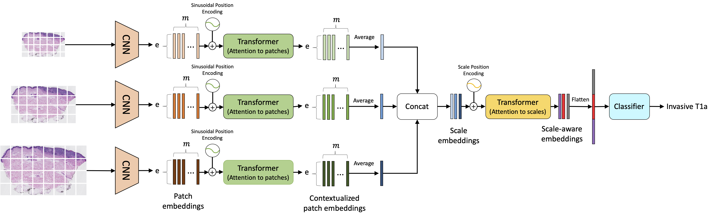

# Scale-Aware Transformers for Diagnosing Melanocytic Lesions




## Introduction

We introduce a novel self-attention-based network to learn representations from digital whole slide images of melanocytic skin lesions at multiple scales. Our model softly weighs representations from multiple scales, allowing it to discriminate between diagnosis-relevant and -irrelevant information automatically. same cases in an independent study.

## Installation

This repo requires the following packages:

- python 3.7.6
- numpy 1.19.2
- opencv-python 4.2.
- pillow 6.1.0
- pytorch 1.7.1
- CUDA 10.2
- NVIDIA GeForce RTX 2080 Ti


We have tested our code only on linux environments. If you are facing issues installing OpenSlide, please check here:
```
https://openslide.org/
```

### Install PyTorch
Please see below webpage for installing PyTorch. We have tested our code with PyTorch 1.0+.

``` 
https://pytorch.org/
```


## Preprocessing
This Step is highly dependent on the format of slide types. In this work, we use tissue regions per slide at resolution of x20 and downsize to get x12.5, x10, x7.5 and x5. Otsu threshold is used to [segment individual tissue slices](https://digitalslidearchive.github.io/HistomicsTK/examples/simple_tissue_detection.html) from a slide. 

For each slide, we computed soft labels using singular value decomposition as described in the paper. 

## Example Dataset File
Check `sample_data` for the format used in dataset files of our experiments. Each line contains one whole slide image slice and follows the following format:
```
patient_id/slices_filename;class_label;soft_label_vector
```

## Training and Evaluation
See scripts `training_script.sh` for training related examples. Our evaluation code evaluates the performance of a model across different metrics, including plots for ROC curves. Please see [cmat_metrics.py](https://github.com/meredith-wenjunwu/ScATNet/blob/master/utilities/metrics/cmat_metrics.py).

